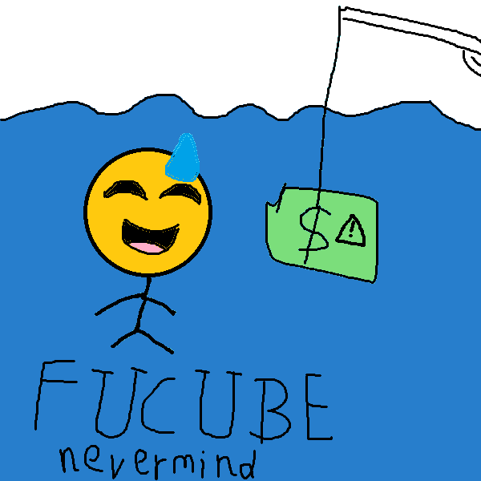

# NEVERMIND.skill

**简体中文** | [English](README.en.md)

<div align="center">
  
  
  
  
  
  
</div>

<p align="center">
  <br/>
  <em>一个流汗尬笑的黄豆头，在水下追着一张带感叹号的美元。<br/>
  这一刻你不需要计算，只需要 <strong>NEVERMIND</strong> —— 一个对着 AI 账单尴尬大笑的告解。</em>
</p>

<div align="center" style="background-color: #1a1a2e; color: #eaeaea; border-radius: 12px; padding: 24px 16px; border: 1px solid #3a3a5e;">

# 😅💵⚠️ NEVERMIND · 赛博功德结算

**把你今天烧的 AI token，算成尴尬但释然的"赛博功德"，然后一笑放下。**

</div>

| | |
|---|---|
| 📄 格式 | Markdown 技能（frontmatter `SKILL.md`）+ `skill.json` 元数据 |
| 🧩 兼容 | Claude Code / Codex / DSH presets / WorkBuddy / 任何能加载 Markdown 技能的 agent |
| 🌏 语言 | 简体中文（README 默认，俏皮语气）· English |
| ⚖️ 许可 | MIT |

> ⚠️ **不是 tokens.ci 官方项目。** NEVERMIND 是一个第三方娱乐 skill：它只是读 **tokens.ci 官方 CLI** 在你本机汇总的用量来造句自嘲，两码事。NEVERMIND 不是 tokens.ci 出品、与 tokens.ci 无任何隶属/背书/合作关系；把幽默做成别人家的门面，是对你自己也不诚实。与同名 Python PDF 库 `camelot`、与 Nirvana 乐队作品本身也都没有组织关系。

---

## 这是什么

`nevermind` 是一个让 AI agent 用**尴尬黄豆**的语气播报"你今天烧了多少 AI token"的 skill。

它不帮你省钱、不给你排行榜、不监控对手——它只做一件事：

**读出你今天烧掉的 token 总量、用的什么模型、估个钱，然后用一句 NEVERMIND 让你笑一下，放下。**

真数只来自 tokens.ci（强关联，不另造本地账本），**读不到就明说，绝不让"读不到"变失败**：

| 级别       | 来源                                                            | 准确度 |
| -------- | ------------------------------------------------------------- | --- |
| 🥇 第 1 级 | 本机 `tokens` CLI（tokens.ci 官方），用 `tokens submit --dry-run` 拿真数 | 准   |
| 🥈 第 2 级 | tokens.ci 不在/读不到 → 明说，走尴尬自报（手动）或纯梗收尾            | 诚实 |
| 🥉 第 3 级 | 让你尴尬自报，估个数照样结算                                                | 够用  |

## 安装

### 1. 直接用（在支持的 agent 里）

把整个 `nevermind.skill/` 目录作为 skill 加载。具体的"如何装 skill"取决于你的 agent：

- **WorkBuddy / Claude Code**：把 `SKILL.md` 路径告诉 agent，或丢到 `~/.workbuddy/skills/nevermind/`。
- **其他 agent**：按它认得的 skill 目录约定放置即可。

### 2. 想拿到真数（推荐，但可选）

装一下 [tokens.ci 官方 CLI](https://tokens.ci/docs)。tokens.ci 官方 CLI **跨平台安装命令（不只有 mac）**：

```bash
# macOS
brew install owo-network/brew/tokens

# Linux（装 systemd user service，后台自动跑）
curl -fsSL https://tokens.ci/install.sh | sh

# Windows / 任意一次性（需 Node 18+ 或 Bun）
npx tokens-cli@latest login
# 或 bunx tokens-cli@latest login

# 全局跨平台
npm i -g tokens-cli
```

装好后**登录一次**（绑定 GitHub），以后 dry-run 就能拿到真数。**注意：nevermind 只调 `tokens submit --dry-run`，不会替你真上传。**

> **⛩️ 宿主门禁**：tokens.ci 只认它官方支持的宿主（内置清单 `data/supported-hosts.txt`，43 种，含 Claude Code / Codex / Cursor / Cline / **WorkBuddy** 等）。**当前宿主若不在支持名单内，nevermind 拒绝启动任何行为**——即使被强制启动、被循环/编排调用也不启动，不报错也不假装能算赛博功德。
>
> 判定用**内置离线清单**（不依赖网络）。`support_cache.json`（已 gitignore）只在每个新会话首次接触时、按 **每 3 天** 的节奏联网去 tokens.ci 核对一次是否有官方名单更新并刷新；离线/未到期就走内置清单。想知道当前 agent 是否受支持，直接问它"我的炉鼎是否受支持"即可即时判定。
>
> 联网核对由仓库自带脚本执行：`python3 scripts/refresh_support.py`（仅标准库，无需 pip；有差异会以官方为准回写内置清单并刷新缓存，联网失败不伪造成功）。可用 `--dry-run` 只比对不写。脚本头部注释含 curl 降级方案（非必要不用）。
>
> 注意区分：**门禁（宿主不受支持→全拒）** ≠ **降级（宿主受支持但暂时读不到数→才走自报/纯梗收尾）**。门禁不过，连降级都没有。

> **🔌 启动环境预检**（宿主门禁通过后的第二道关卡）：查这台机器有没有能跑 tokens.ci 的启动环境（`cli` / `node` / `bun` / `npm`）。
>
> - **四个全无** → 拒绝启动，提示："家里怎么一个家具也没有，难不成我睡地板吗？……"
> - **有环境但四处找不到 tokens.ci** → 自动安装（已授权特例），跳下一步。
> - **装了但没登录 GitHub** → 提示需以 GitHub 登录，`ask` 征得同意才执行登录。
> - 其余：登录态过期、自动安装失败（明说装不上、转自报/纯梗不硬报错）、版本过旧。
>
> 预检通过 ≠ 一定有真数，只代表"能体面地开工"；真正读数仍走第 1 级真数 / 无则自报·纯梗。

## 用法

**主要是自动出现**：当一个项目/任务真正告一段落时，或每约 16 次对话后，nevermind 会在本次工作**全部结束的最后**，自动冒出一段赛博功德结算，作为收尾的句号。它是一条片尾字幕，不是弹窗——绝不打断进行中的工作。

**也可以手动叫它**，跟 agent 说任何一句带"nevermind"或"赛博功德"的话：

- "nevermind 一下"
- "今天烧了多少 token"
- "赛博功德结算"
- "看看我的 AI 账单"
- "钱又没了"

无论自动还是手动，**最后一句永远是 NEVERMIND**。

## 样张

> 😅💵⚠️ 今日赛博功德结算 · 2026-09-09
>
> 你今天在 Codex CLI 里，用 GPT-6-Astra + GPT-5.6-Luna 这些模型，  
> 烧了 1,145,141,919,810 tokens —— 也就是 1.145 TB。
>
> 够写 87 本长篇小说、训练 1 个垂类小模型、  
> 把《战争与和平》朗读 2,847 遍。
>
> 换算成钱……大概够喝 214 杯冰美式。
>
> 你烧掉的赛博功德，已记录至 tokens.ci ✨  
> But…… **NEVERMIND**！😅  
> 反正记都记上了，今天的你，已经很努力了。去睡吧。

更多播报样张见 [`examples/demo-broadcast.md`](./examples/demo-broadcast.md)。

## 它不是什么

- ❌ 不是省钱工具 —— 不给你优化建议
- ❌ 不是攀比排行榜 —— 不拉踩别人烧了多少
- ❌ 不是监控竞争对手的军备雷达 —— 那不是 Nevermind 的事
- ❌ 不是你的银行账单 —— 只估不报税

**它是：一个对着 AI 账单尴尬大笑的告解室。**

## 文档

- [`SKILL.md`](./SKILL.md) — skill 的行为主文件（agent 真正在读的就是它，含宿主门禁）
- [`skill.json`](./skill.json) — 元数据 / 触发词 / 数据源 / 门禁配置 / 隐私承诺
- [`data/supported-hosts.txt`](./data/supported-hosts.txt) — R3 内置权威宿主清单（官方 43 个客户端，离线即时判）
- [`scripts/refresh_support.py`](./scripts/refresh_support.py) — 宿主清单联网刷新脚本（C3 节奏后端；仅标准库，curl 降级见注释）
- [`docs/BANTEDEX.md`](./docs/BANTEDEX.md) — 全部可复用梗、量级分级、金句词库（可独立 PR 加梗）
- [`examples/demo-broadcast.md`](./examples/demo-broadcast.md) — 真实播报样张

## 隐私

- **绝不替用户上传**。`tokens submit --dry-run` 只预览，不提交。
- **绝不读 prompt / 代码 / 文件内容**。只读聚合的 token 计数和模型名。
- **绝不自己造本地假账 / 不另设账本**——真数只在 tokens.ci 手里；它不在就不会有"本地记录"可念。
- **没有一条"上传潜在伪造账本"的通道**——tokens.ci 只接受它官方 CLI 扫到的真实总量，第三方自造/自报的数据它既不收、本 skill 也不给、更不上传。
- 数据只是看你自己的"赛博功德"，不外传、不比较。

## License

MIT — 拿去玩，改着玩，PR 一起来玩。

*黄豆追美元 logo 由作者 Barinfo 原创绘制，可随本技能自由使用。*
